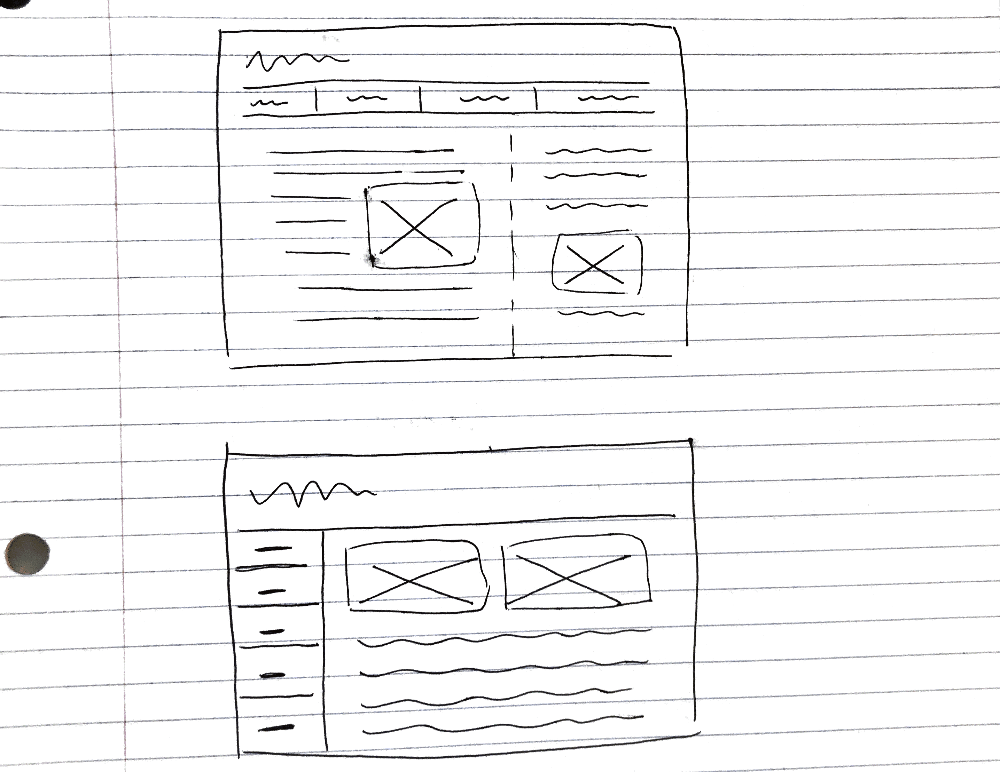
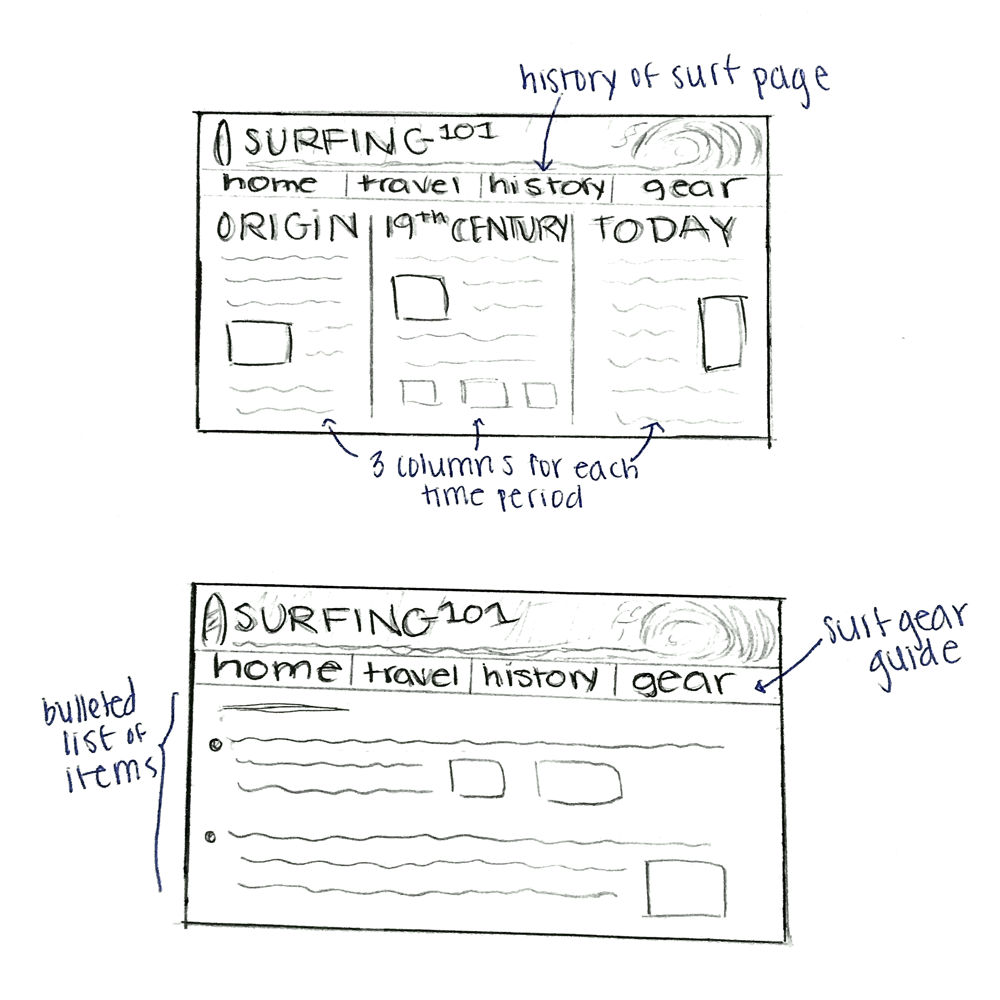
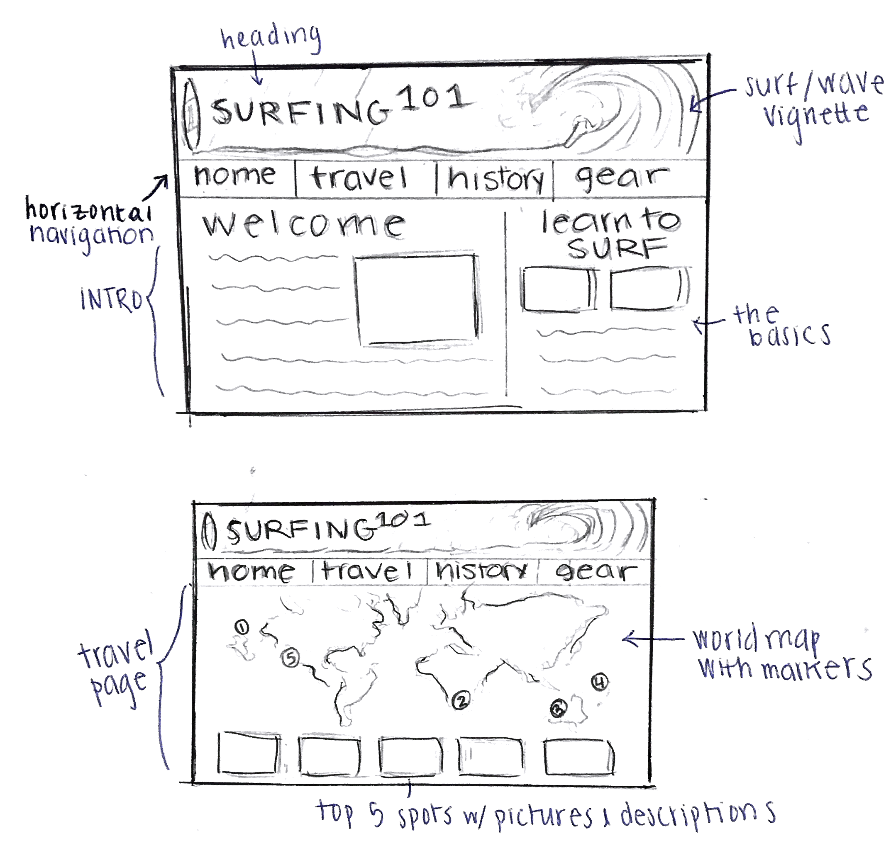

# Project 1, Milestone 1 - Design & Plan

Your Name: Mia Casey

## 1. Persona


I've selected **Abby** as my persona.

I've selected my persona because Abby has opposite qualities from me in four out of the five aspects we studied. Abby has low self-efficacy, comprehensive information processing, process-oriented learning, and risk averse attitude towards technology. This difference will force me to satisfy the needs of all types of users.

## 2. Sketches
I created pretty simple sketches because the design would work well for Abby. She has low confidence or self-efficacy when working with technology so I wanted to sketch something that was easy to navigate. Abby rarely has spare time so I wanted her to be able to take in all the essential information of the website. Below are two different sketches to satisfy the needs of Abby:



## 3. Wireframes





## 4. Coding Plan & Pseudocode


I will have three subfolders: images, includes, and styles. Images will hold all the images (.svg) that I plan to use.

Includes will hold three php **includes**; **header.php, footer.php, and init.php.** The header include will create the surfing vignette image with the main header and the navigation bar (with a **loop** and **conditional statement**). The footer include will include my information and email. The init include will hold the page and title names (in an **array**) and will be included in the four main pages.

The styles folder will hold one css file named **all.css** for all of my styles.

The four pages will be in the project folder: **index.php, travel.php, history.php,** and **gear.php**. The index page will have two columns (formatted in all.css) and basic text with images. The travel page will use the HTML <map> tag to include ~5 clickable areas of the map linking to the surf spot's description and image below. The history page will have three columns documenting three eras in surf history with basic text and images. Lastly, the gear page will use a list (in an **array**) of the gear that you need to acquire to surf. This will require a non-trivial **user defined PHP function** that outputs elements of the array into a list.

Pseudocode for my user defined function:

```
function print_gear(item)
  prints out the item description in an <li> tag
end function
```

and for the HTML body:

```
for each(item in gear)
  call the function print_gear(item)
end for each loop
```
